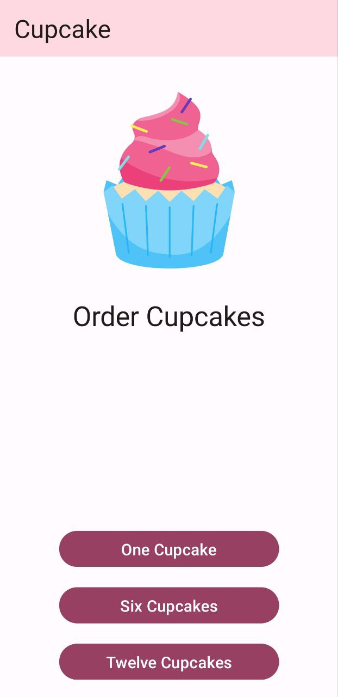
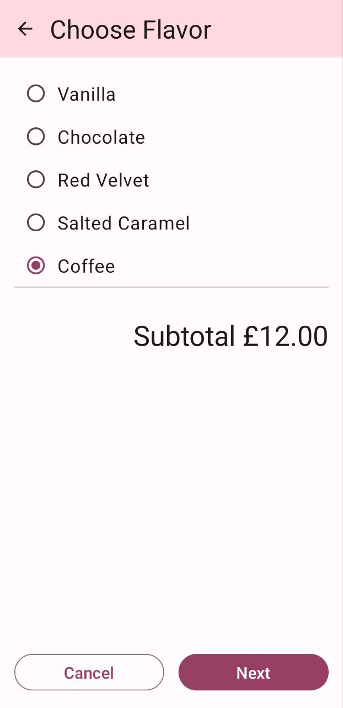
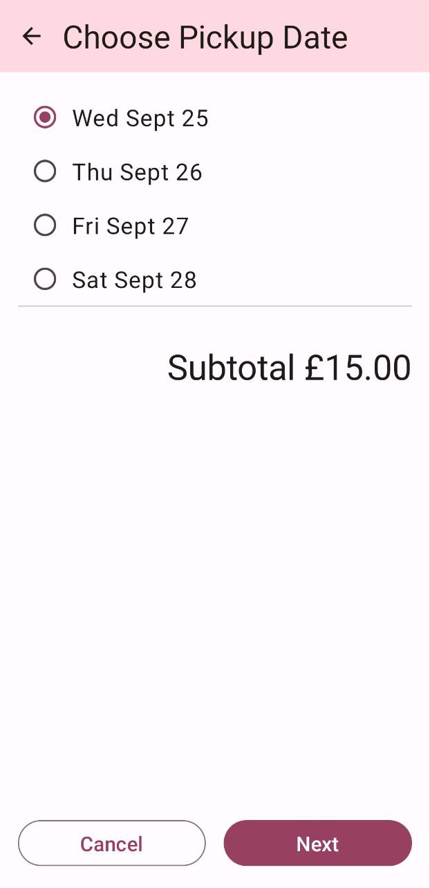
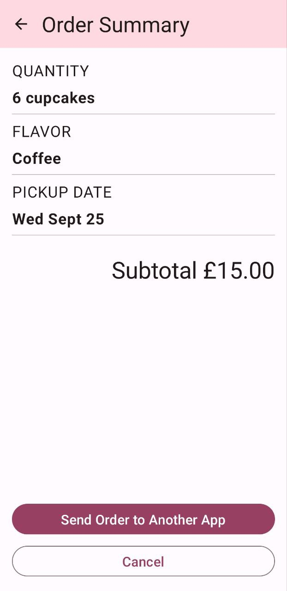

Cupcake App
=================================

This app provides an order flow for cupcakes, allowing users to select options such as quantity, flavor, and pickup date. The order details are displayed on an order summary screen and can be shared with another app to send the order.

### Features
- **Navigation**: The app implements a structured navigation flow using Jetpack Navigation, enabling seamless transitions between screens.
- **UI and Navigation Testing**: UI tests and navigation tests are included to ensure the app's functionality and navigation flow are robust and reliable.
- **Multi-language Support**: The app includes localization features, allowing it to be translated into other languages, such as Arabic, to cater to a wider audience.

---

### Pre-requisites
- Experience with Kotlin syntax.
- Familiarity with creating and running a project in Android Studio.
- Knowledge of building composable functions in Jetpack Compose.

---
### Screenshots

---

### Getting Started

1. **Install Android Studio**, if not already installed.
2. **Download the sample** project.
3. **Import the sample** into Android Studio.
4. **Build and run the app** on an emulator or device.
